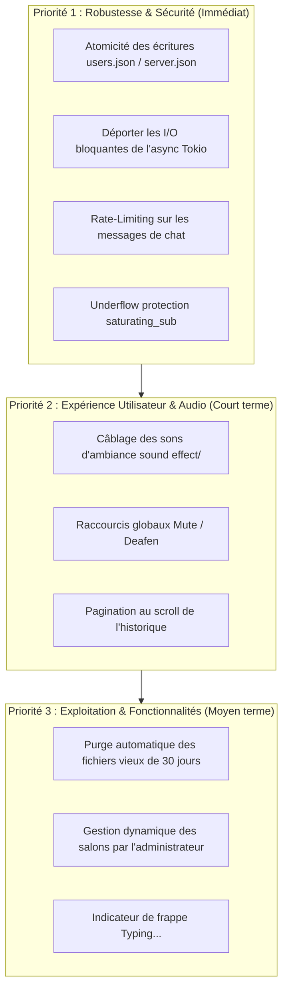

# 🛡️ Rapport d'Audit Technique — Projet `ki-chat`

**Date de l'audit :** 16 août 2026  
**Périmètre :** Workspace complet Rust (`protocol`, `server`, `voice`, `ki-opus`, `client-quic`, `client-cli`, `client-gui`, déploiements Docker et workflows CI/CD).  
**Contrainte spécifique :** Le système de connexion/authentification actuel (Argon2id, jetons d'invitation initiaux) est préservé conformément à la volonté du propriétaire du projet.

---

## 📑 Table des matières
1. [Évaluation Globale & Architecture](#1-évaluation-globale--architecture)
2. [Problèmes Identifiés & Bugs / Code Smells](#2-problèmes-identifiés--bugs--code-smells)
3. [Problèmes Potentiels, Risques & Limites Techniques](#3-problèmes-potentiels-risques--limites-techniques)
4. [Audit des Dépendances & Versions de Packages](#4-audit-des-dépendances--versions-de-packages)
5. [Fonctionnalités Manquantes Recommandées](#5-fonctionnalités-manquantes-recommandées)
6. [Plan d'Action Priorisé](#6-plan-daction-priorisé)

---

## 1. Évaluation Globale & Architecture

Le projet **ki-chat** présente un niveau d'ingénierie et de qualité logicielle **remarquable** :
- **Transport Réseau Unifié :** Utilisation de **QUIC (Quinn / TLS 1.3)** pour agréger sur un seul flux chiffré les canaux de contrôle fiables et les datagrammes vocaux non fiables à très faible latence.
- **Moteur Audio de Pointe :** Intégration native de **libopus 1.6.1** compilée statiquement avec les technologies **DRED** (*Deep Redundancy*) et **Deep PLC**, couplée à un jitter buffer adaptatif (RFC 3550) et à des modèles de débruitage neuronal local (**DeepFilterNet3** / **RNNoise**).
- **Sécurité Défensive :** Chiffrement de bout en bout de la voix avec **XChaCha20-Poly1305**, validation stricte des vignettes PNG (protection contre les bombes de décompression et fichiers polyglottes), assainissement des chaînes UTF-8 et protection des secrets locaux par **Windows DPAPI**.
- **Client Graphique Soigné :** Interface **egui** performante, icônes vectorielles personnalisées sans dépendances de polices externes, liaison statique `/MT` sans dépendance au redistribuable Visual C++, et auto-updater GitHub release intégré.

---

## 2. Problèmes Identifiés & Bugs / Code Smells

### 🔴 2.1. I/O synchrones bloquantes sur l'exécuteur Tokio asynchrone (Serveur)
- **Localisation :**
  - [`crates/server/src/accounts.rs`](crates/server/src/accounts.rs) : `Accounts::save()` exécute `std::fs::write` synchrone sous lock `parking_lot::Mutex`.
  - [`crates/server/src/quic.rs`](crates/server/src/quic.rs) : alors que `authenticate` et `change_password` sont déportés via `spawn_blocking`, les handlers `AdminSetBanned`, `AdminCreateInvite`, `AdminResetPassword`, et `SetAvatar` exécutent des appels bloquants directement sur le thread de la tâche asynchrone QUIC.
  - [`crates/server/src/history.rs`](crates/server/src/history.rs) : `append()` fait un `writeln!` synchrone sous mutex `parking_lot::Mutex<File>`.
  - [`crates/server/src/meta.rs`](crates/server/src/meta.rs) : `update()` effectue un `std::fs::write` synchrone.
- **Impact :** En cas de latence I/O ou de disque chargé, le thread de l'exécuteur Tokio est suspendu, ce qui peut créer des micro-coupures ou des retards dans le relais des datagrammes vocaux et des messages de contrôle.
- **Correction recommandée :** Déporter les écritures de fichiers vers `tokio::fs` ou envelopper les méthodes de sauvegarde dans `tokio::task::spawn_blocking`.

---

### 🔴 2.2. Non-atomicité des écritures de fichiers (`users.json`, `server.json`)
- **Localisation :** [`crates/server/src/accounts.rs:85`](crates/server/src/accounts.rs#L85), [`crates/server/src/meta.rs:39`](crates/server/src/meta.rs#L39)
- **Impact :** `std::fs::write` tronque le fichier existant avant d'écrire. En cas de coupure de courant, de redémarrage forcé du serveur ou de crash pendant l'opération, le fichier `users.json` ou `server.json` se retrouve tronqué à 0 octet. Au redémarrage suivant, `serde_json::from_str` échoue et le serveur refuse de démarrer.
- **Correction recommandée :**
  ```rust
  let tmp_path = format!("{}.tmp", self.path);
  std::fs::write(&tmp_path, &json)?;
  std::fs::rename(&tmp_path, &self.path)?;
  ```

---

### 🔴 2.3. Risque d'underflow panique dans la consommation d'invitation
- **Localisation :** [`crates/server/src/accounts.rs:132`](crates/server/src/accounts.rs#L132)
- **Code :**
  ```rust
  inner.invites[pos].uses_left -= 1;
  ```
- **Impact :** Bien que le check `invite.uses_left > 0` soit présent en amont, si une incohérence survient (ou si le fichier JSON a été édité manuellement avec `uses_left: 0`), une soustraction sur un entier non signé `u32` provoque un panic en mode debug.
- **Correction recommandée :** Utiliser `saturating_sub(1)` :
  ```rust
  inner.invites[pos].uses_left = inner.invites[pos].uses_left.saturating_sub(1);
  ```

---

### 🔴 2.4. Absence de Rate-Limiting sur les messages de chat (Anti-Spam)
- **Localisation :** [`crates/server/src/quic.rs`](crates/server/src/quic.rs)
- **Impact :** `Throttle` protège les tentatives d'authentification, mais aucun limiteur de débit n'est appliqué aux messages `ClientMsg::Chat`. Un client modifié pourrait envoyer des milliers de messages par seconde, saturant la mémoire glissante, le fichier d'historique `channel-{id}.jsonl` et la bande passante des autres utilisateurs.
- **Correction recommandée :** Implémenter un limiteur par jetons (*token bucket*) limitant chaque client à par exemple 5 messages par seconde.

---

## 3. Problèmes Potentiels, Risques & Limites Techniques

### ⚠️ 3.1. Absence de quota global et de purge sur l'upload de fichiers (DoS Disque)
- **Localisation :** [`crates/server/src/files.rs`](crates/server/src/files.rs)
- **Impact :** Bien que chaque fichier unitaire soit borné à 25 Mo, il n'y a ni quota global de disque, ni purge automatique par ancienneté. Les fichiers s'accumulent indéfiniment dans `data/files/`, ce qui peut saturer l'espace disque du serveur hôte / VPS.
- **Recommandation :** 
  1. Ajouter une tâche de nettoyage périodique supprimant les fichiers temporaires de plus de 15 ou 30 jours.
  2. Implémenter un plafond de stockage global configurable (ex. 10 Go).

---

### ⚠️ 3.2. Rééchantillonneur audio linéaire vs Sinc / Polyphase
- **Localisation :** [`crates/voice/src/resample.rs`](crates/voice/src/resample.rs)
- **Impact :** Le `LinearResampler` effectue une interpolation linéaire du premier ordre. Lors de la conversion 44.1 kHz ⇄ 48 kHz, cela induit une légère atténuation des hautes fréquences et du repliement de spectre (*aliasing*), audible sur des équipements audio haute-fidélité.
- **Recommandation :** Remplacer l'interpolation linéaire par un rééchantillonneur polynomial cubique (Hermite) ou une bibliothèque dédiée comme `rubato`.

---

### ⚠️ 3.3. Absence de pagination au défilement dans l'historique de salon
- **Localisation :** [`crates/client-gui/src/main.rs`](crates/client-gui/src/main.rs), [`crates/protocol/src/lib.rs`](crates/protocol/src/lib.rs)
- **Impact :** Le client demande `ClientMsg::History { limit: 100 }`. Si un salon contient des milliers de messages, seuls les 100 derniers sont consultables dans l'interface graphique. Les messages antérieurs stockés dans le fichier `.jsonl` restent inaccessibles.
- **Recommandation :** Ajouter un message protocolaire `ClientMsg::HistoryBefore { channel, before_ts, limit }` et déclencher le chargement lorsque l'utilisateur fait défiler la vue vers le haut.

---

### ⚠️ 3.4. Fichiers d'effets sonores non connectés à l'UI
- **Localisation :** Dossier `sound effect/` (`mute.ogg`, `unmute.ogg`, `join.ogg`, `leave.ogg`, `message.ogg`)
- **Impact :** Ces fichiers existent dans le projet mais ne sont actuellement pas chargés ni joués dans le client graphique lors des événements correspondants (seul un son sinusoïdal de test est synthétisé).
- **Recommandation :** Décompresser les fichiers audio au démarrage et les jouer via `VoiceEngine` lors des transitions de micro, des entrées/sorties de salon vocal et des réceptions de messages.

---

### ⚠️ 3.5. Gestion de la déconnexion de périphérique audio à chaud (USB Unplug)
- **Localisation :** [`crates/client-gui/src/net.rs`](crates/client-gui/src/net.rs)
- **Impact :** Lorsqu'un casque ou un micro USB est débranché, le stream `cpal` signale une erreur. L'application ne rebascule pas automatiquement sur le périphérique par défaut du système avec une notification visible pour l'utilisateur.

---

## 4. Audit des Dépendances & Versions de Packages

Le projet est remarquablement à jour sur la grande majorité des bibliothèques de l'écosystème Rust :

| Package | Version du Projet | Dernière Version / Statut | Analyse & Recommandations |
| :--- | :--- | :--- | :--- |
| **`axum`** | `0.8.1` | `0.8.x` | ✅ **À jour**. Axum 0.8 est la version la plus récente avec le nouveau modèle de routing et d'extracteurs. |
| **`eframe` / `egui`** | `0.32.0` | `0.32.x` | ✅ **À jour**. Excellente réactivité et support GPU moderne. |
| **`quinn`** | `0.11.9` | `0.11.x` | ✅ **À jour & Stable**. Maintient la compatibilité QUIC v1 (RFC 9000). |
| **`rustls`** | `0.23.23` | `0.23.x` | ✅ **À jour**. Configuration moderne avec le crypto-provider `ring`. |
| **`rand`** | `0.9.1` | `0.9.x` | ✅ **À jour**. Rand 0.9 est la dernière version majeure. |
| **`windows`** | `0.61.0` | `0.61.x` | ✅ **À jour**. Bindings officiels Microsoft récents. |
| **`image`** | `0.25.6` | `0.25.x` | ✅ **À jour**. |
| **`tokio`** | `1.43.0` | `1.43.x` | ✅ **À jour**. |
| **`serde`** | `1.0.219` | `1.0.x` | ✅ **À jour**. |
| **`ureq`** | `2.12.1` | `3.0.x` (disponible) | ⚠️ **Mise à jour majeure disponible**. `ureq 3` réécrit l'API autour de `http 1.0`. `2.12.1` reste parfaitement stable pour l'upload de fichiers actuel. |
| **`deep_filter`** | Git `tag = "v0.5.6"` | `v0.5.6` | ℹ️ **Épinglé via Git**. Choix très pertinent pour garantir la reproductibilité du build avec le modèle ONNX/Tract. |
| **`libopus`** | `1.6.1` (C CMake) | `1.6.1` | ✅ **Version la plus avancée**. Intègre les dernières optimisations DRED et OSCE. |

---

## 5. Fonctionnalités Manquantes Recommandées

### 🎙️ Audio & Vocal
1. **Raccourcis Globaux Clavier Supplémentaires :**
   - *Mute Toggle* (Couper/Activer le micro via un raccourci clavier global en arrière-plan).
   - *Deafen Toggle* (Sourdine complète : couper le micro et couper la sortie casque).
2. **Effets Sonores Intégrés :**
   - Jouer les sons du dossier `sound effect/` (coupure micro, remise du micro, entrée/sortie d'un utilisateur dans le salon vocal, réception d'un message).
3. **Indicateur de Mauvaise Qualité / Pertes de Paquets pour les Pairs :**
   - Afficher un badge d'avertissement à côté du pseudo d'un utilisateur si sa liaison réseau présente des pertes > 10 %.
4. **Mode Audio Stéréo Optionnel :**
   - Permettre de basculer en stéréo (48 kHz à 96 ou 128 kbps) pour le partage de son de jeu ou de musique.

---

### 💬 Chat Texte & Expérience Utilisateur
1. **Pagination de l'Historique :**
   - Chargement dynamique des messages plus anciens lors du scroll vers le haut.
2. **Indicateur de Frappe (*"X est en train d'écrire..."*) :**
   - Message protocolaire léger `ClientMsg::Typing` diffusé avec expiration au bout de 4 secondes.
3. **Mentions d'Utilisateurs (`@pseudo`) :**
   - Détection des mentions dans les messages, mise en surbrillance et notification visuelle dans la barre des tâches Windows (`FlashWindow`).
4. **Recherche de Messages :**
   - Barre de recherche rapide (`Ctrl + F`) dans l'historique du salon textuel.
5. **Aperçu et Téléchargement des Fichiers Non-Images :**
   - Carte de téléchargement pour les archives `.zip`, documents `.pdf`, etc., avec bouton direct « Enregistrer sous... ».

---

### 🛠️ Administration & Exploitation Serveur
1. **Gestion Dynamique des Salons :**
   - Commandes admin pour créer, renommer ou supprimer des salons textuels et vocaux (`ClientMsg::AdminCreateChannel`, `ClientMsg::AdminDeleteChannel`) directement depuis l'interface client.
2. **Purge Automatique du Stockage :**
   - Tâche de fond automatique supprimant les fichiers hébergés vieux de plus de $N$ jours.
3. **Journal d'Audit Administratif :**
   - Fichier de log dédié (`data/audit.log`) consignant les expulsions, bannissements, réinitialisations de mots de passe et créations d'invitations.

---

## 6. Plan d'Action Priorisé



---
*Rapport généré pour le projet ki-chat.*
